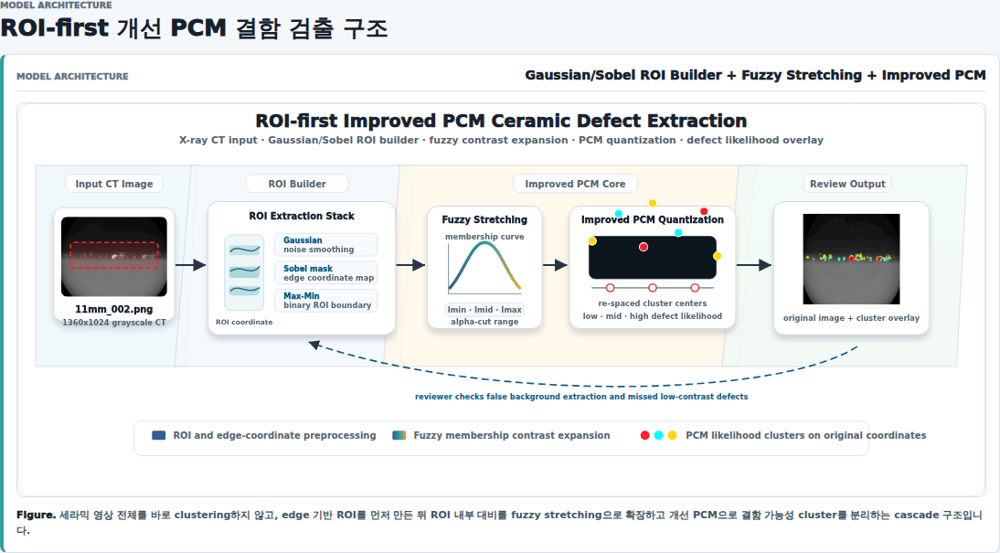
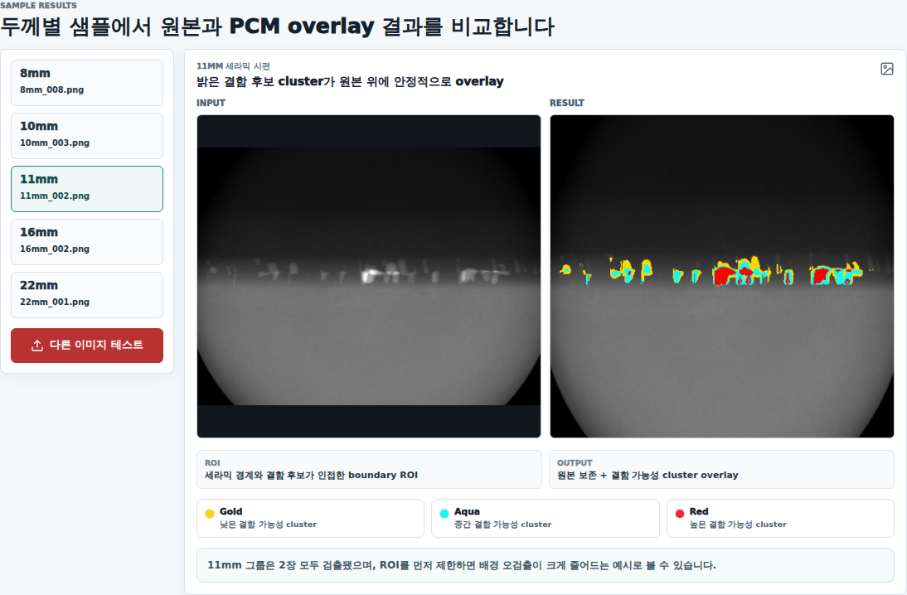

# Ceramic X-ray Defect Extraction

세라믹 X-ray 비파괴 검사 영상에서 저대비 결함 후보를 검출하기 위해 ROI-first 전처리와 개선 PCM(Possibilistic C-Means)을 연결한 포트폴리오 프로젝트입니다. 논문에서 제안한 Gaussian/Sobel 기반 ROI 추출, fuzzy stretching, PCM quantization 흐름을 .NET 8 API와 React 웹 데모로 재구성했습니다.

Paper: [PCM 알고리즘을 이용한 세라믹 영상에서의 결함 검출](https://www.dbpia.co.kr/journal/articleDetail?nodeId=NODE09262448)

## Problem & Approach

비파괴 검사는 제품 신뢰성과 제조 공정 품질을 위해 필요하지만, 수작업 육안 검사에 의존하면 검사 속도, 인력 비용, 결과 일관성에서 한계가 생깁니다. 세라믹 X-ray CT 영상은 결함과 배경의 명암 차이가 작고 시편 끝단의 밝기 변화가 불규칙하기 때문에, 단순 K-means/PCM 계열 접근은 배경 영역을 결함 후보로 함께 추출하거나 실제 결함을 놓치기 쉽습니다.

이 프로젝트의 핵심은 전체 영상을 바로 clustering하지 않는 것입니다. 먼저 Gaussian filtering과 Sobel edge, Max-Min 이진화로 결함 후보가 존재할 가능성이 높은 ROI를 좁히고, ROI 내부에서 fuzzy stretching으로 대비를 확장한 뒤 개선 PCM으로 결함 가능성 cluster를 분리합니다. 마지막 출력은 원본 좌표계를 유지한 상태에서 결함 가능성 cluster만 overlay한 PNG입니다.

## Architecture



처리 흐름은 legacy C# 알고리즘을 웹 API로 재구성하면서 다음 단계로 정리했습니다.

1. 입력 X-ray 이미지를 고정 작업 크기인 `454 x 426`으로 resize합니다.
2. RGB 이미지를 grayscale map으로 변환합니다.
3. Gaussian blur와 Sobel edge로 ROI 탐색용 edge map을 만듭니다.
4. Max-Min 기반 ROI와 polarity peak band를 이용해 결함 후보 영역을 좁힙니다.
5. ROI 내부에서 Sobel map을 다시 만들고 fuzzy stretching으로 약한 경계를 강화합니다.
6. erase candidate map을 구성해 결함 후보 gray value만 PCM 입력으로 보냅니다.
7. 개선 PCM으로 low/mid/high 결함 가능성 cluster를 계산합니다.
8. 검정 배경을 제외한 cluster 픽셀만 원본 위치에 overlay합니다.

## Web Demo Result



웹 페이지는 대표 케이스를 정적 assets로 먼저 보여주고, `다른 이미지 테스트` 버튼을 통해 서버의 `x-ray` 폴더에 있는 이미지를 선택하면 API inference를 실행합니다. 기본 진입 케이스는 `11mm_002.png`이며, 원본과 PCM overlay 결과를 나란히 비교할 수 있게 구성했습니다.

Overlay 색상은 결함 가능성 cluster의 상대적 강도를 의미합니다.

| Color | Meaning |
| --- | --- |
| Gold | 낮은 결함 가능성 cluster |
| Aqua | 중간 결함 가능성 cluster |
| Red | 높은 결함 가능성 cluster |

## API Design

API는 ASP.NET Core Minimal API와 ImageSharp 기반으로 구현했습니다.

| Endpoint | Method | Purpose |
| --- | --- | --- |
| `/api/ceramic/files` | `GET` | 서버 `x-ray` 폴더의 이미지 목록 반환 |
| `/api/ceramic/server-image?relativePath=...` | `GET` | 선택한 원본 이미지 preview 반환 |
| `/api/ceramic/v1/server-file?relativePath=...` | `POST` | 서버 파일을 읽어 개선 PCM 처리 후 PNG blob 반환 |
| `/api/ceramic/v1` | `POST` | multipart form의 `image` 필드로 업로드된 이미지 처리 |

Input은 `BMP`, `JPG`, `JPEG`, `PNG` 이미지를 지원하며, 최대 업로드 크기는 `50MB`입니다. `server-file` API는 `/app/x-ray`로 mount된 서버 데이터셋 내부의 상대 경로만 허용하도록 path traversal을 차단합니다.

Output은 `image/png` binary입니다. 웹 프론트는 이 응답을 object URL로 변환해 기존 Result 영역만 교체하고, 원본 Input preview와 해석 UI는 유지합니다.

## Implementation Notes

- `api/`: .NET 8 기반 ceramic defect extraction API
- `api/v1/processing.cs`: ROI 탐색, fuzzy stretching, PCM overlay pipeline
- `api/v1/advanced_pcm.cs`: 개선 PCM clustering 로직
- `x-ray/`: API 테스트용 서버 이미지 폴더
- `assets/`: README에 사용하는 포트폴리오 캡처 이미지
- `Clustering/`: BSDS500 기반 clustering 데모 API

정적 대표 케이스 결과는 웹 포트폴리오의 front assets에 저장해 첫 화면에서 API 호출 없이 즉시 렌더링되도록 했습니다. 반면 사용자가 `다른 이미지 테스트`를 선택한 경우에만 API를 호출해 실제 처리 결과를 받아오도록 분리했습니다.

## Run

단독 API 실행:

```bash
cd /home/nami/repo/gpt_analysis/project/Fault-Extraction-of-Ceramic-Images/api
docker compose up -d --build
```

포트폴리오 전체 스택에서 실행:

```bash
cd /home/nami/repo/awesome
docker compose up -d --build ceramic-api front
```

웹 데모:

```text
http://192.168.0.11:3000/projects/computer-vision/ceramic
```
